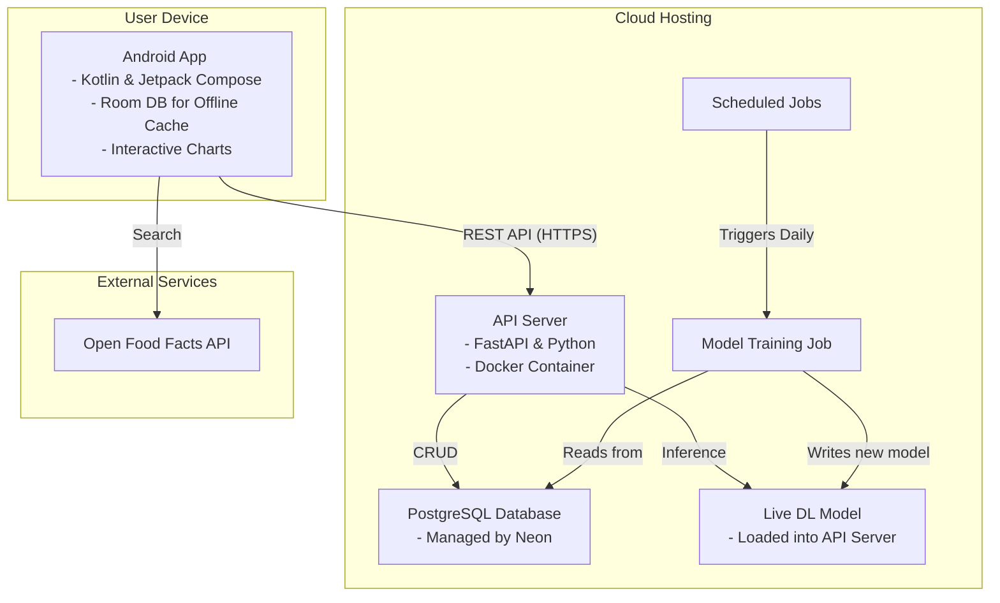

# Technical Specification: Nutrition & Performance App

This document provides a detailed technical plan for building a personal, high-performance, and feature-rich nutrition and activity logging application. The system is designed for detailed tracking, daily model retraining, and interactive data visualization.

## 1. System Architecture & Technology Choices

The architecture is designed for performance, reliability, and scheduled automated tasks.

### 1.1. Architecture Diagram

### 1.2. Technology Stack

-   **Backend:** **FastAPI** with Python.
- **Database:** **PostgreSQL** on **Neon** for reliability and managed operations.
-   **Hosting:** **Docker** container on a cloud platform for simple, scalable deployment.
-   **Scheduled Jobs:** **Scheduler** to trigger daily model retraining.
-   **Android App:** **Kotlin** with **Jetpack Compose**, **Room** for a robust offline cache, **Retrofit** for API communication, and **MPAndroidChart** for interactive, native plotting.
-   **Authentication:** **JWT** for stateless, secure authentication.

## 2. Revised Data Models & Database Schema

The schema is expanded to support detailed logging and custom user data.

### `users` table
-   `id`, `email`, `hashed_password`, `age`, `sex`, `height_cm`, `weight_kg`, `created_at`

### `food_logs` table
-   `id` (UUID, PK)
-   `user_id` (UUID, FK)
-   `food_name` (VARCHAR)
-   `quantity` (FLOAT, NOT NULL)
-   `unit` (VARCHAR, e.g., 'g', 'ml', 'serving')
-   `calories` (FLOAT, NOT NULL)
-   `protein_g` (FLOAT)
-   `carbs_g` (FLOAT)
-   `fat_g` (FLOAT)
-   `logged_at` (TIMESTAMP WITH TIME ZONE, NOT NULL)

### `sport_activities` table
-   `id` (UUID, PK)
-   `user_id` (UUID, FK)
-   `activity_name` (VARCHAR, NOT NULL)
-   `duration_minutes` (INTEGER, NOT NULL)
-   `calories_expended` (FLOAT)
-   `logged_at` (TIMESTAMP WITH TIME ZONE, NOT NULL)

### `custom_foods` table
-   `id` (UUID, PK)
-   `user_id` (UUID, FK)
-   `food_name` (VARCHAR, NOT NULL)
-   `calories_per_100g` (FLOAT, NOT NULL)
-   `protein_per_100g` (FLOAT)
-   `carbs_per_100g` (FLOAT)
-   `fat_per_100g` (FLOAT)

## 3. Revised API Specification

### Authentication
-   `POST /api/v1/auth/register`
-   `POST /api/v1/auth/token`
-   `GET /api/v1/users/me`

### Food Logging
-   `POST /api/v1/logs`
-   `GET /api/v1/logs?date=YYYY-MM-DD`
-   `PUT /api/v1/logs/{log_id}`
-   `DELETE /api/v1/logs/{log_id}`
-   `GET /api/v1/logs/summary?date=YYYY-MM-DD` **(New)**

### Sport Logging
-   `POST /api/v1/sports` **(New)**
-   `GET /api/v1/sports?date=YYYY-MM-DD` **(New)**
-   `DELETE /api/v1/sports/{activity_id}` **(New)**

### Custom Foods
-   `POST /api/v1/custom-foods` **(New)**
-   `GET /api/v1/custom-foods` **(New)**
-   `DELETE /api/v1/custom-foods/{food_id}` **(New)**

### Prediction & Visualization
-   `GET /api/v1/predict/latest`
-   `GET /api/v1/plots/weight` **(New)**
-   `GET /api/v1/plots/metabolism` **(New)**
-   `GET /api/v1/plots/energy-balance` **(New)**

### Model Management
-   `POST /api/v1/admin/retrain` **(New, protected)**

## 4. Detailed Milestone Documents
- [Milestone 1: Backend Foundation (Revised)](./01_backend_setup.md)
- [Milestone 2: Core Logic & Model Integration (Revised)](./02_model_integration.md)
- [Milestone 3: Android App MVP (Revised)](./03_android_mvp.md)
- [Milestone 4: Feature Enhancement (Revised)](./04_feature_enhancement.md)
- [Milestone 5: Deployment & Automation (Revised)](./05_deployment.md)